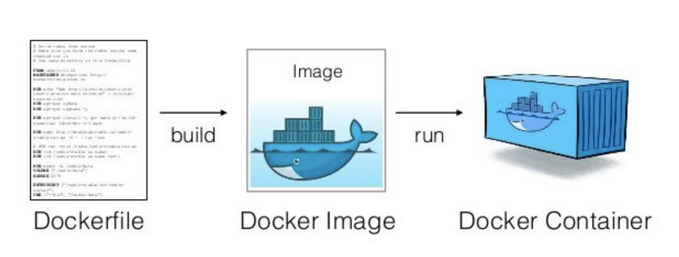

# Git, Docker i letimo

## Git

Sustav za **verzioniranje koda**. Neizbježan alat ako više ljudi razvija programski kod. Najčešće se koristi u terminalu, ali postoje i GUI aplikacije.

Najčešće naredbe:
- `git clone git@github.com:AutorImeRepozitorija` - klonira repozitorij lokalno na vaše računalo,
- `git pull origin ImeGrane` - preuzimate kod (i promijene u njemu) s Git-a s grane ImeGrane,
- `git status` - pregled promijena koje ste radili naspram onima koje ste preuzeli s Git-a,
- `git add ImeDatoteke` - priprema sve promijenjene datoteke koje želite poslati na Git,
- `git commit -m "Poruka"` - U navodnicima ide poruka što rade promijene (preporuka u imperativu),
- `git push origin ImeGrane` - Šaljete (pushate) svoje promijene na Git na željenu granu ImeGrane,
- `git checkout ImeGrane` - promijena na drugu granu,
- `git branch -b ImeNoveGrane` - stvaranje nove grane (budite oprezni trebate pushati tu promijenu da bude vidljiva).

Postoji još puno naredbi koje možete potražiti na internetu. Za početak predlažem mergeanje izravno na githubu.

**NOTA BENE**
- nakon promijena uvijek je dobro pregledati koje su stvari izmjenile ili su nove s naredbom:
    
    ```bash
    git status
    ```
- nakon svojih promijena uvijek pushajte svoj kod, najčešća špranca prilikom pushanja je da pushate sve svoje promijene:
    
    ```bash
    git add .
    git commit -m "Add new ROS node for path planning"
    git push origin master
    ```
- ako znate da je netko drugi radio promijene preuzmite (pullajte) kod, pogotovo ako radite na istoj grani:

    ```bash
    git pull origin master
    ```

Česte prepreke:
- konflikti prilikom mergeanja,
- pushanje, a nije napravljen pull,

## Docker

Docker je detaljnije objašnjen u [wiki](https://github.com/larics/docker_files/wiki). Predlažem da prethodni link pročitate u slobodno vrijeme.

Trenutno na ovoj razini možete svhatiti docker kao vrstu virtualne mašine (iako krivo dovoljno dobro prezentira ideju). Koristi se da na brz, efikasan i poprilično lagan način prenosime sustav s jednog robota na drugog. 

Primjer, na letjelici smo razvijali sustav cijeli preddiplomski projekt i instalirali smo puno novih biblioteka, posložili puno raznih skripti u sustavu i dva tjedna prije predaje letjelica padne u vodu i sve izgubimo. Koliko nam treba vremena da ponovo posložimo sve to? Sjećamo li se uopće svih promijena? Rješenje: Ako sve te stvari spremimo u docker, na novu letjelicu stavimo sustav u manje od 5min. 



Najčešće naredbe:
- `docker ps -a` - ispiše sve instalirane kontejnere te kad je koji pokrenut,
- `docker image -ls` - ispiše sve docker image koji postoje na računalu,
- `docker build` - iz Dockerfilea stvaramo Imagem,
- `docker run` - iz Imagea stvarmo Container,
- `docker exec -it ImeContainera bash` - pokrećemo container.

Na ovoj razini dovoljno je pratiti naredbe koje će biti u sljedećem poglavlju. Docker postaje/je neizbježan alat u svim granama računarstva, telekomunikacija, robotike i sl.


Citirati:
```@article{Markovic2023TowardsAS,
  title={Towards A Standardized Aerial Platform: ICUAS’22 Firefighting Competition},
  author={Lovro Markovic and Frano Petric and Antun Ivanovic and Jurica Goricanec and Marko Car and Matko Orsag and Stjepan Bogdan},
  journal={Journal of Intelligent \& Robotic Systems},
  year={2023},
  volume={108},
  pages={1-13},
  url={https://api.semanticscholar.org/CorpusID:259503531}
}
```