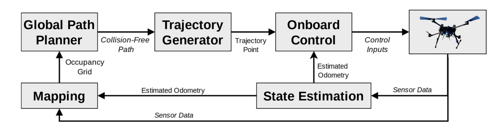

# Git, Docker i letimo

## Git

Sustav za **verzioniranje koda**. Neizbježan alat ako više ljudi razvija programski kod. Najčešće se koristi u terminalu, ali postoje i GUI aplikacije.

Najčešće naredbe (nemojte ih štrebat, susret ćete ih previše puta):
- `git clone git@github.com:AutorImeRepozitorija` - klonira repozitorij lokalno na vaše računalo,
- `git pull origin ImeGrane` - preuzimate kod (i promijene u njemu) s Git-a s grane ImeGrane,
- `git status` - pregled promijena koje ste radili naspram onima koje ste preuzeli s Git-a,
- `git add ImeDatoteke` - priprema sve promijenjene datoteke koje želite poslati na Git,
- `git commit -m "Poruka"` - U navodnicima ide poruka što rade promijene (preporuka u imperativu),
- `git push origin ImeGrane` - Šaljete (pushate) svoje promijene na Git na željenu granu ImeGrane,
- `git checkout ImeGrane` - promijena na drugu granu,
- `git branch -b ImeNoveGrane` - stvaranje nove grane (budite oprezni trebate pushati tu promijenu da bude vidljiva).

Postoji još puno naredbi koje možete potražiti na internetu. Za početak predlažem mergeanje izravno na githubu.

Postavljanje ssh ključa. Olakšava korištenje git-a. [HOWTO!](https://docs.github.com/en/authentication/connecting-to-github-with-ssh/generating-a-new-ssh-key-and-adding-it-to-the-ssh-agent)
- ```bash 
  ssh-keygen -t ed25519 -C "ivo.ivic@gmail.com"
  ```
- ```bash 
  eval "$(ssh-agent -s)"
  ```
- ```bash
  ssh-add ~/.ssh/id_ed25519
  ```
- ```bash
  cat ~/.ssh/id_ed25519.pub
  ```
- string koji je iskočio kopirajte i zalijepite u githubu ssh-key settings.

**NOTA BENE**
- nakon promijena uvijek je dobro pregledati koje su stvari izmjenile ili su nove s naredbom:
    
    ```bash
    git status
    ```
- nakon svojih promijena uvijek pushajte svoj kod, najčešća špranca prilikom pushanja je da pushate sve svoje promijene:
    
    ```bash
    git add .
    git commit -m "Add new ROS node for path planning"
    git push origin master
    ```
- ako znate da je netko drugi radio promijene preuzmite (pullajte) kod, pogotovo ako radite na istoj grani:

    ```bash
    git pull origin master
    ```

Česte prepreke:
- konflikti prilikom mergeanja,
- pushanje, a nije napravljen pull,

## Docker

Docker je detaljnije objašnjen u [wiki](https://github.com/larics/docker_files/wiki). Predlažem da prethodni link pročitate u slobodno vrijeme.

Trenutno na ovoj razini možete svhatiti docker kao vrstu virtualne mašine (iako krivo dovoljno dobro prezentira ideju). Koristi se da na brz, efikasan i poprilično lagan način prenosime sustav s jednog robota na drugog. 

Primjer, na letjelici smo razvijali sustav cijeli preddiplomski projekt i instalirali smo puno novih biblioteka, posložili puno raznih skripti u sustavu i dva tjedna prije predaje letjelica padne u vodu i sve izgubimo. Koliko nam treba vremena da ponovo posložimo sve to? Sjećamo li se uopće svih promijena? Rješenje: Ako sve te stvari spremimo u docker, na novu letjelicu stavimo sustav u manje od 5min. 


Najčešće naredbe:
- `docker ps -a` - ispiše sve instalirane kontejnere te kad je koji pokrenut,
- `docker image -ls` - ispiše sve docker image koji postoje na računalu,
- `docker build` - iz Dockerfilea stvaramo Imagem,
- `docker run` - iz Imagea stvarmo Container,
- `docker exec -it ImeContainera bash` - pokrećemo container.

Na ovoj razini dovoljno je pratiti naredbe koje će biti u sljedećem poglavlju. Docker postaje/je neizbježan alat u svim granama računarstva, telekomunikacija, robotike i sl.

## Hands-on #1

1. Kloniranje repozitorija:
    ```bash
    git clone git@github.com:JakobDomislovic/PredDiplProj2024.git
    cd PredDiplProj2024/
    ```
2. Podijela u tri tima:
    - Gripper
    - PathPlanning
    - RobotVision
3. Svaki tim (voditelj tima) neka napravi direktorij (folder) unutar repozitorija:
    ```bash
    mkdir Gripper
    ```
4. Uđite u repozitorij, napravite README.md te u njega zapišite ime time i članove:
    ```bash
    cd Gripper
    nano README.md
    ```
5. Pushajte svoje promijene na github (NB: Morate natrag ući u glavni direktorij PredDiplProj2024 jer je tamo file .git koji zna kako da se to prebaci na github, drugi repozitoriji to nemaju!):
    ```bash
    cd .. # prebacivanje u direktorij ispod
    git status # pregledajte svoje promijene
    git add . 
    git commit -m "Add Gripper team!"
    git push origin master
    ```
6. README.md unutar svojeg direktorija koristite kao dnevnik rada (weekly report). Ne napraviti ništa je isto ok ako postoji valjani razlog :-). 
7. U nastavku ćemo stvoriti docker container koji će se koristiti za simulaciju, sve skripte su unaprijed pripremljene, samo ih pokrenite.
8. Stvaranje slike iz Dockerfilea, to jest buildanje:
    ```bash
    ./docker_build.sh
    ```
9. Prvo pokretanje i stvaranje containera:
    ```bash
    ./first_docker_run.sh
    ```
10. Nadalje pokrećite simulaciju sa:
    ```bash
    ./start_docker.sh
    ```

## Flight stack
U progamiranju ćete često doći do termina *stack*, to ustvari prestavlja programske blokove koji mogu raditi samostalno, ali kada se povežu čine jedan veći sustav. U nastavku će primjer takvog stacka biti LARICS-ov stack za autonomno letenje.

Stack je stavljen u docker container te se može lako preuzeti, u njemu su osnovni dijelovi koji su potrebni da bi letjelica letila. U nastavku je slika koja prikazuje dijelove stacka, ne trebate ih znati sve nego je samo dato kao primjer.


S obzirom da su roboti skupi, a i uvijek smo kratki s vremenom, praksa je da se u robotici sve prvo isproba u simulaciji. Zato ćemo mi koristiti isti taj stack, ali već pretvoren u simulaciju.

### TMUX
Glavne stvari kako se kretati u tmux i zašto se koristi.

## Hands-on #2 


Citirati:
```@article{Markovic2023TowardsAS,
  title={Towards A Standardized Aerial Platform: ICUAS’22 Firefighting Competition},
  author={Lovro Markovic and Frano Petric and Antun Ivanovic and Jurica Goricanec and Marko Car and Matko Orsag and Stjepan Bogdan},
  journal={Journal of Intelligent \& Robotic Systems},
  year={2023},
  volume={108},
  pages={1-13},
  url={https://api.semanticscholar.org/CorpusID:259503531}
}
```